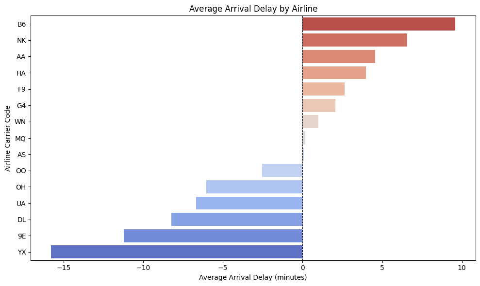
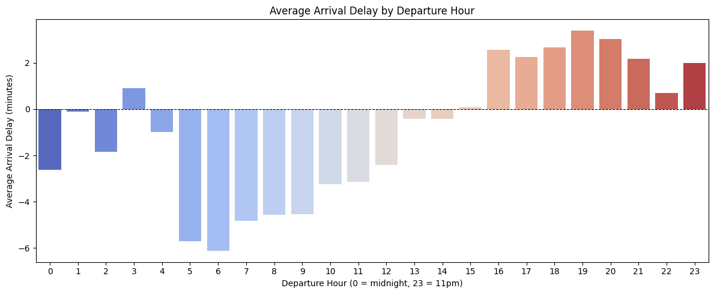
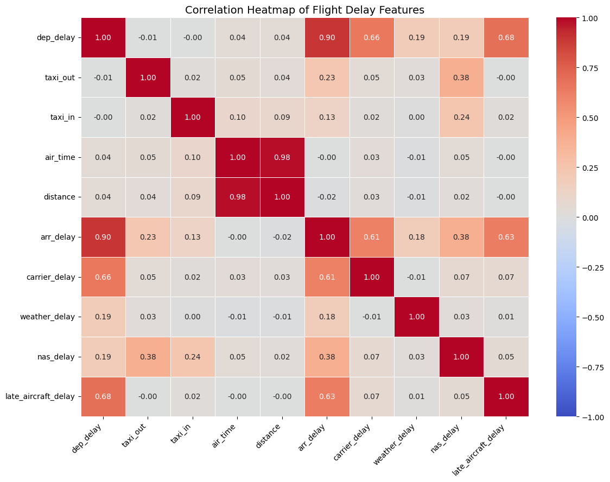

# U.S. Flight Delay Analysis — 2024

A hypothesis-driven analysis of 100,000 U.S. domestic flights, examining what actually drives arrival delays across airlines, airports, and times of day.

**Headline finding:** Departure delay alone explains 81% of variance in arrival delay (r = 0.90). Distance and flight duration explain almost none.

📊 **Dataset:** [huggingface.co/datasets/avihayamor/US_flight-delay-2024](https://huggingface.co/datasets/avihayamor/US_flight-delay-2024)

🗺️ **Interactive map:** [huggingface.co/spaces/avihayamor/flight-delay-map-2024](https://huggingface.co/spaces/avihayamor/flight-delay-map-2024)

📓 **Notebook:** [Open in Colab](https://colab.research.google.com/drive/10lKxNniqdxiz8zS1i4NnEQP8I9wqanWG#scrollTo=3cHhDnDYujc2)

---

## Approach

Four research questions defined upfront, each targeting a distinct hypothesis about what drives delay:

1. **Carrier effect** — Do some airlines run materially later than others?
2. **Time-of-day effect** — Do delays compound through the day?
3. **Geographic effect** — Are some origin airports structurally delay-prone?
4. **Operational drivers** — Which numeric features actually predict `arr_delay`?

Findings are framed in terms of effect size and predictive strength, not just descriptive averages.

---

## Key Findings

| Question | Finding |
|---|---|
| Carrier | Budget carriers (B6, NK) run 6–9 min late on average; regionals and Delta arrive ahead of schedule |
| Time of day | 5–6am flights arrive early; delays grow steadily and peak around 7pm |
| Geography | Florida hubs (MIA, MCO) post the highest average delays; MSP, BOS, ATL perform best |
| Predictors | `dep_delay` (0.90), `late_aircraft_delay` (0.63), `carrier_delay` (0.61) dominate. Distance and airtime ≈ 0. |

---

## Visuals

**Average delay by carrier**

**Average delay by hour of day**

**Correlation heatmap**

---

## Data

- **Source:** Kaggle — [Flight Data 2024](https://www.kaggle.com/datasets/hrishitpatil/flight-data-2024)
- **Sample:** 100,000 rows, 35 columns
- **Target:** `arr_delay` (minutes; positive = late)

**Cleaning:** removed cancelled flights, missing `arr_delay`, and outliers beyond [-100, +300] minutes (<0.3% of rows).

---

## Limitations & Next Steps

**Limitations**
- Single-year sample (2024) — may not generalize across weather cycles or operational regimes
- `dep_delay` is the strongest predictor but is itself downstream; useful for in-flight prediction, weak for pre-departure forecasting
- Carrier rankings reflect 2024 only, not long-term performance

**Next Steps**
- Regression model excluding `dep_delay` to isolate truly pre-departure predictors
- Merge weather data to test how much airport-level variation is structural vs. weather-driven
- Extend to multi-year data to separate stable carrier effects from year-specific shocks

---

## Tech

Python · pandas · matplotlib · seaborn · plotly · Jupyter

---

## Author

**Avihay Amor** — [linkedin.com/in/avihay-amor](https://linkedin.com/in/avihay-amor)
